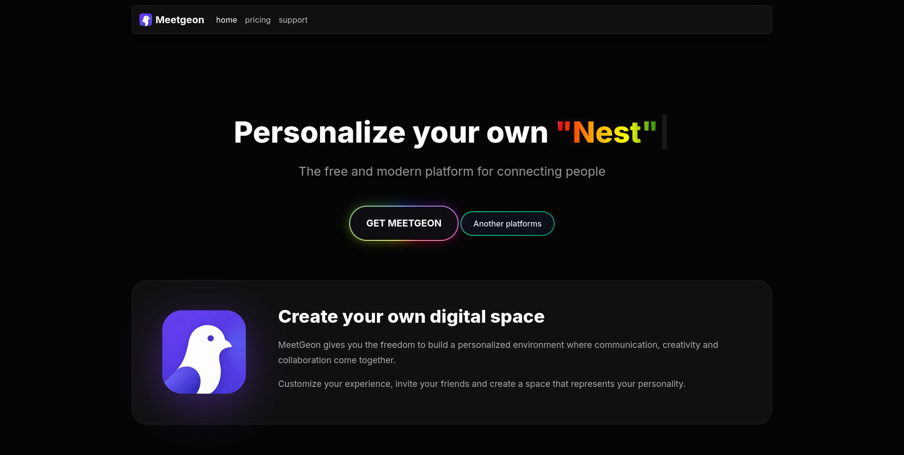
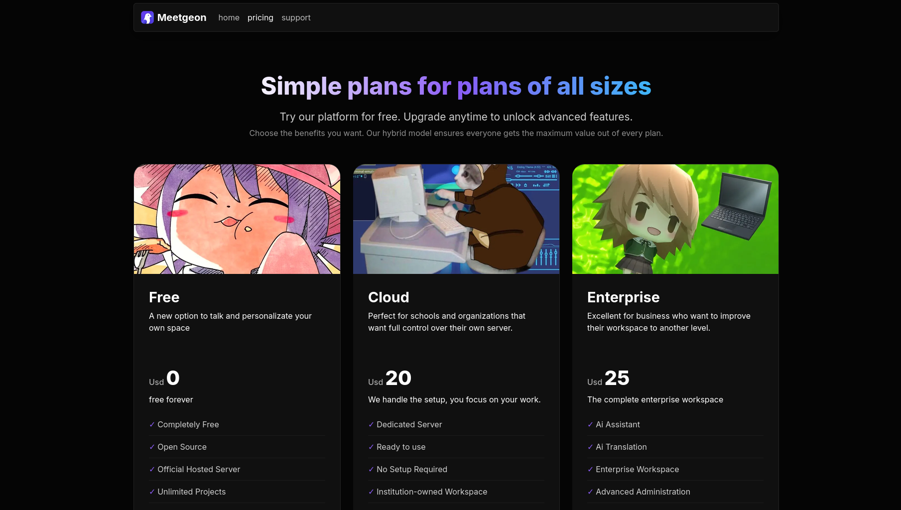
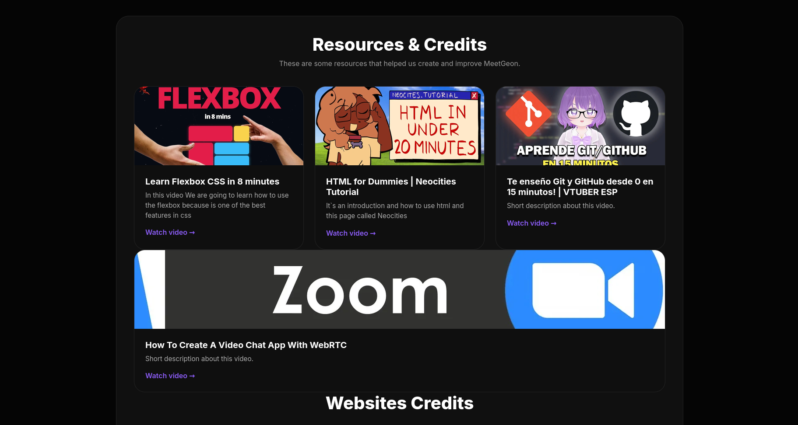

# 🌌 MeetGeon

> **The free and modern platform for connecting people.**

MeetGeon is an open-source project focused on creating a highly customizable social platform where everyone can build their own digital space, express their personality, and connect with others in a unique way.

This repository contains the official landing page of the project.

---

## 📖 About

The goal of MeetGeon is to rethink how people interact online.

Instead of offering the same experience to everyone, MeetGeon aims to let every user create their own personalized environment called a **Nest**—a digital space designed around their own preferences, creativity, and identity.

In the future, users will be able to:

- 🎨 Fully customize their own Nest
- 👤 Create and personalize unique avatars
- 🤝 Visit and interact with other users' spaces
- 🌍 Build communities around shared interests
- ✨ Enjoy an experience where every profile feels different

MeetGeon is designed around the idea that **personalization should be the core of social interaction**, not just an extra feature.

---

## 🚀 Vision

MeetGeon is planned to become an **open-source platform** where anyone can contribute, learn, and help shape its future.

As the project grows, the long-term vision is to adopt a **hybrid business model**, allowing the community edition to remain free and open while offering optional premium services for organizations and advanced users.

The priority will always be the community and the freedom to personalize your experience.

---

## 🌟 Main Features (Planned)

- 🎨 Highly customizable digital spaces (**Nests**)
- 👤 Avatar system
- 🌐 Community interaction
- 🏠 Personal profiles and environments
- 🔓 Open-source community edition
- ☁️ Cloud hosting options
- 🏢 Enterprise solutions
- 🤖 Future AI-powered features

---

## 💻 Current Status

MeetGeon is currently in its early development stage.

At the moment, this repository contains the project's landing page, built to present the vision and future direction of the platform.

Future repositories will include the backend, frontend application, infrastructure, and documentation.

---

## 🛠️ Built With

- HTML5
- CSS3
- JavaScript
- Bootstrap 5

---

## 📷 Preview

### Hero Section

### Plans

### Resources

> *(Replace these images with actual screenshots from your project.)*

---

## 🤝 Contributing

MeetGeon is planned to become an open-source community project.

Contributions, ideas, feedback, and discussions will always be welcome as the platform evolves.

---

## 📜 License

The project is planned to be released under the **GNU AGPL v3 License**, ensuring that improvements made to the platform remain open for the community.

*(License may change before the first stable release.)*

---

## 💜 Philosophy

> **Your space. Your avatar. Your community.**

We believe every person deserves a place on the internet that truly feels like their own.

MeetGeon isn't just another social platform—it's a place where everyone can build their own digital home.

---

### ⭐ If you like this project, consider giving it a star!
